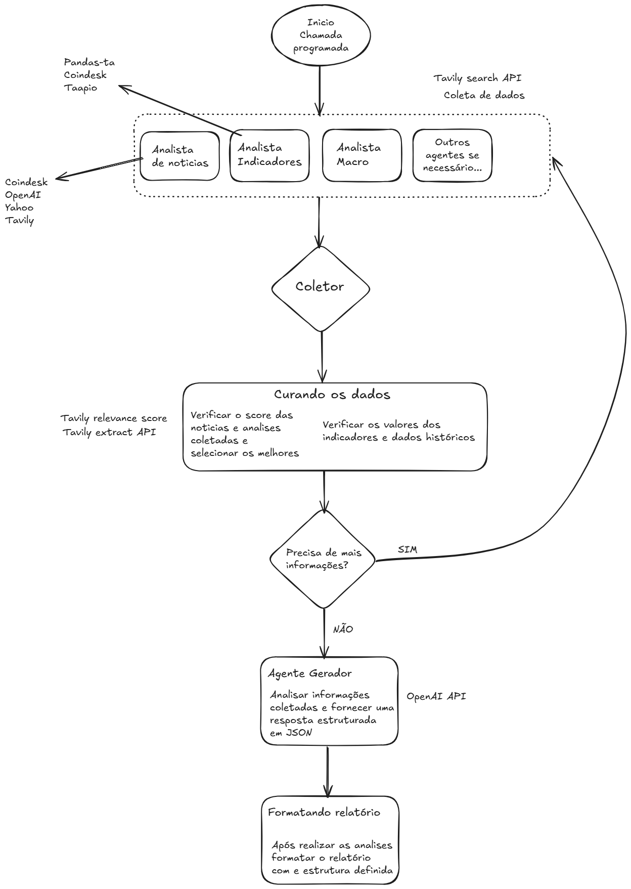

# Projeto Relatórios Técnicos com Agentes
- Repositorio teste para agentes que geram relatórios técnicos sobre o Bitcoin.


## Comandos para atualizar o repositório
```bash
git add .
git commit -m "Descrição das alterações"
git push
```

## Comandos para rodar o projeto
```bash
python agente.py
```

## Comandos para testar prompts diferentes

- Rodar a função `testar_prompt_com_dados_cacheados` no arquivo `teste_prompt.py` para testar diferentes prompts com dados cacheados.

## Diagrama inicial do projeto
